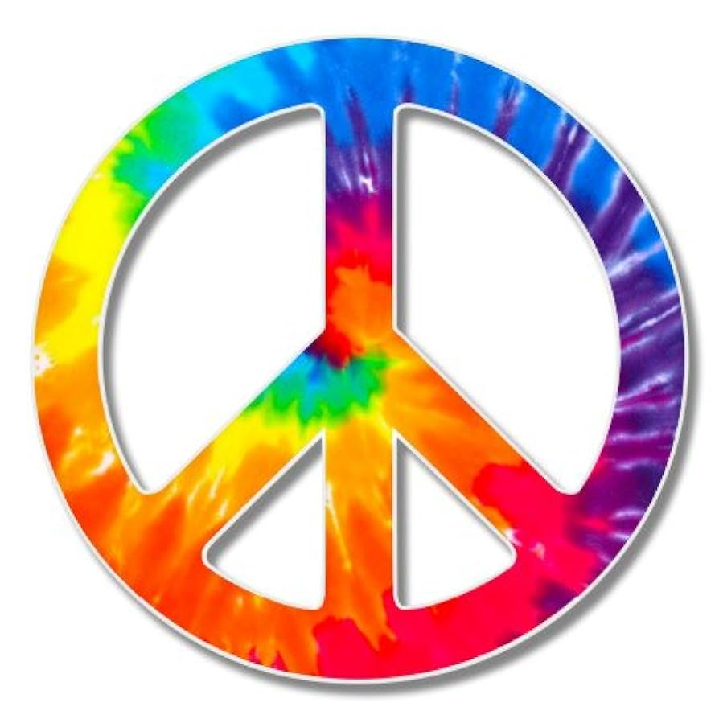

# Project Proposal

1. Roughly, what will your drawing look like - I want my drawing to look like a double peace sign.

2. What are two variables you could use so that when you change each variable, the drawing changes? Circumference, radius, et cetera. 

3. Where is there repetition in your drawing? The circle and the interior will be repeated twice.   

4. What are the main parts of your drawing? Are there clear sections or objects? There is the circle and the interior. 

5. How could you use a loop variable of a for loop? Is there somewhere in your drawing where something is repeated, but it's slightly different each time? Maybe the same object is repeated in different places, or maybe a similar object is repeated but with different sizes? I can change the speed each time.

